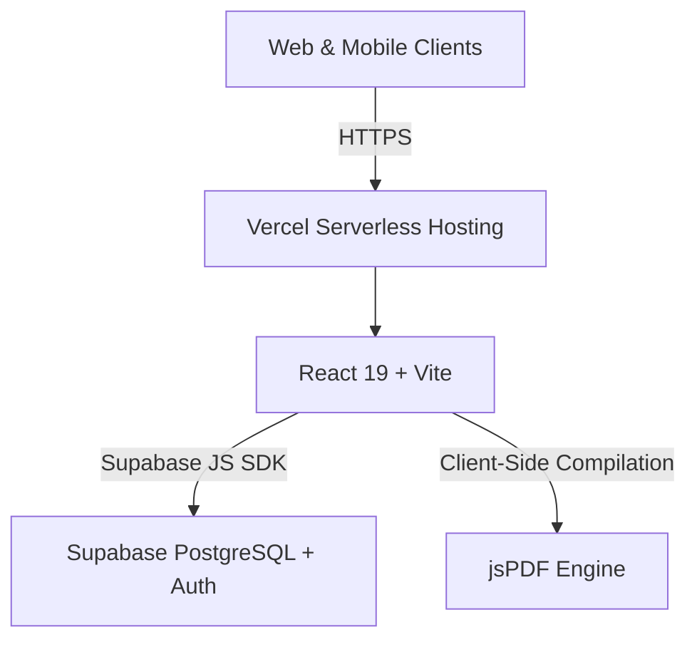
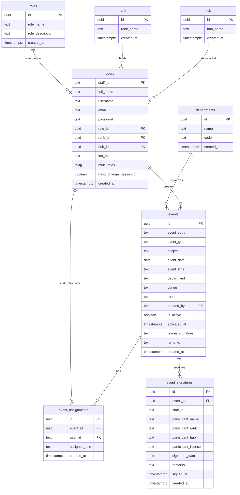

# AttendSync Flow — System Documentation

**Project Name:** AttendSync Flow  
**Organization:** AirAsia Indonesia (Flight Operations / FOP)  
**Repository:** [https://github.com/iaaautopilot-hub/attendSync.git](https://github.com/iaaautopilot-hub/attendSync.git)  
**Platform:** Web Application (Responsive Desktop & Mobile)  
**Author / Team:** Flight Operations Automation & Digitalization  

---

## 1. Executive Summary

**AttendSync Flow** is an enterprise-grade digital attendance and training management system built specifically for AirAsia Flight Operations (FOP), Cabin Crew, and related aviation departments.

The platform eliminates paper-based attendance rosters by enabling meeting chairpersons and instructors to launch digital sessions, project dynamic QR codes, collect verified attendee signatures directly from personal mobile devices, track instructor flight training hours, and generate DGCA/compliance-ready PDF reports with cryptographic QR verification stamps.

---

## 2. Core Architecture & Technology Stack



### Front-End
- **Framework:** React 19 (Hooks, Context, Router v7)
- **Bundler & Tooling:** Vite 8
- **Styling:** Custom Vanilla CSS (Design system with AirAsia Red `#E21629`, dark theme `#050505`, glassmorphism, responsive mobile drawer)
- **Icons:** Lucide React
- **Digital Signatures:** HTML5 Canvas (`react-signature-canvas`)
- **QR Code Engine:** `qrcode` & `qrcode.react`
- **Document Generation:** `jspdf` & `jspdf-autotable`

### Back-End & Infrastructure
- **Database:** Supabase PostgreSQL (managed cloud database)
- **Authentication:** Supabase Auth (Google Workspace SSO `@airasia.com`) + salted bcrypt credential fallback
- **Hosting / CI/CD:** Vercel

---

## 3. Database Schema & Data Model

The application utilizes an 8-table relational schema designed for referential integrity, automated cascades, and fast indexing:



---

## 4. Key Functional Modules

### 4.1. Authentication & Role-Based Access Control (RBAC)
- **Google SSO:** Direct one-click login for `@airasia.com` corporate accounts.
- **Multi-Role System:** Users can possess multiple concurrent privileges:
  - **System Administrator:** Unrestricted access, department management, user permissions.
  - **Admin:** Event scheduling, user directory administration, report audits.
  - **Chairman:** Leads meetings, verifies attendee lists, signs session closures.
  - **Instructor:** Conducts training courses, views instructor training logs & hours analytics.
- **Session Security:** Token expiration handling, bcrypt hash migration, and route guards.

### 4.2. Event Lifecycle & Scheduling
- **Event Classification:** Supports `Meeting` and `Training` session types.
- **Department Tagging:** Scoped to `Flight Operation` (FOP), `Cabin Crew` (CC), `Facilities Management & OHS`, and `Flight Operation Integrated` (FOPI).
- **Multi-Leader Assignment:** Assigns one or more instructors or chairpersons per session.
- **Activation Security Window:** 
  - Sessions must be activated by the assigned leader using a digital verification seal.
  - Active sessions automatically expire after **8 hours** to prevent unauthorized post-session check-ins.

### 4.3. Contactless QR Attendance System
- **Dynamic Projection Screen (`/qr/:eventId`):** Displays a live, responsive QR code designed for meeting room projectors or tablets.
- **Mobile Check-In (`/attend/:eventId`):**
  1. Attendee scans QR code using any smartphone camera.
  2. Input of `Staff ID` automatically pulls full name, rank, license/LOA, and base hub from the database.
  3. Attendee draws their digital signature on the HTML5 touch canvas.
  4. Real-time duplicate submission check prevents multiple check-ins by the same staff.

### 4.4. Live Event Dashboard & PDF Report Generator
- **Real-Time Polling:** Automatically refreshes the attendee roster every 5 seconds without manual page reload.
- **License / LOA Override:** Allows administrators or instructors to verify and update staff license numbers directly on the roster before finalizing reports.
- **Aviation Compliance PDF Export:**
  - Standard A4 formal AirAsia document layout.
  - Embedded corporate headers, document control codes, and metadata.
  - Two-column or full-width signature tables containing digitized participant signatures.
  - Chairperson digital verification stamp with QR code verification hash.

### 4.5. Training Hours & Instructor Analytics (`/analytics`)
- **Automated Duration Calculation:** Parses event start and end times (supporting `[END:HH:MM]` tags).
- **Instructor KPI Summary:**
  - Total Training Hours delivered
  - Total Sessions conducted
  - Active Instructors count
  - Average Hours per Instructor
- **Drill-Down Modals:** View complete session history, venues, and participant counts for each individual instructor.
- **Multi-Level Filters:** Filter by department, specific calendar month (`YYYY-MM`), and instant search query.

### 4.6. Administration & User Management (`/users` & `/departments`)
- Add, update, and deactivate staff records.
- Configure multi-role assignments.
- Store license / Letter of Authority (LOA) credentials.
- Manage department structures and departmental code identifiers.

---

## 5. Security & Aviation Compliance Controls

1. **Audit Readiness:** Every attendance entry logs exact timestamp (`signed_at`), device signature blob, and staff ID.
2. **Session Tamper Resistance:** Event links cannot receive submissions before activation or after the 8-hour expiry window.
3. **Database RLS & Isolation:** PostgREST queries enforce department filtering and assignment boundaries.
4. **Data Privacy:** Passwords hashed with standard bcrypt salt rounds; signatures stored as compressed vector/PNG data URIs.

---

## 6. Deployment & Environment Setup

### Environment Variables (`.env`)
```bash
# Supabase Configuration
VITE_SUPABASE_URL=https://nqjhcopbxroxabithxpm.supabase.co
VITE_SUPABASE_ANON_KEY=sb_publishable_5j0CYMyR3DtM919K6G0GOQ_xM4K0Mvk
```

### Local Development
```bash
# Install dependencies
npm install

# Run Vite development server
npm run dev

# Build for production
npm run build
```

---

## 7. Operational Directory Structure

```
├── .env                              # Environment variables (Supabase URL & Key)
├── database_migration/               # Migration toolkit
│   ├── 01_schema.sql                 # PostgreSQL DDL schema & RLS policies
│   ├── 02_all_data.sql               # Complete SQL data inserts
│   ├── export_data.js                # Data extraction utility
│   ├── import_to_new_supabase.js     # Automated data batch uploader
│   └── README.md                     # Database migration instructions
├── public/                           # Static assets (icon.png, favicon)
├── src/
│   ├── App.jsx                       # Master routing & responsive navigation
│   ├── db.js                         # Supabase database abstraction layer
│   ├── index.css                     # Design tokens & core styles
│   ├── lib/
│   │   └── supabase.js               # Supabase client initialization
│   ├── pages/
│   │   ├── AttendanceForm.jsx        # Mobile attendee sign-in & canvas
│   │   ├── ChangePassword.jsx        # User account settings
│   │   ├── CreateEvent.jsx           # Session creation wizard
│   │   ├── EventDashboard.jsx        # Live monitor, verification & PDF export
│   │   ├── EventList.jsx             # Searchable historical events catalog
│   │   ├── Login.jsx                 # Google SSO & staff login
│   │   ├── ManageDepartments.jsx     # Department management
│   │   ├── QRDisplay.jsx             # Big-screen QR code projector
│   │   ├── TrainingAnalytics.jsx     # Instructor training hours dashboard
│   │   └── UserManagement.jsx        # Staff & permissions management
│   └── utils/
│       ├── departmentUtils.js        # Departmental permissions logic
│       ├── pdfExport.js              # Compliance A4 PDF generation engine
│       └── timeUtils.js              # Aviation training hour calculation
└── vercel.json                       # Vercel deployment routing configuration
```
